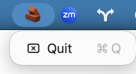

# Scroll Blocker

A tiny macOS menu bar app that **blocks all scroll wheel events**. It exists so that when I play [generals.io](generals.io) with a mouse, accidental scrolling does not ruin a match. Scroll Blocker sits quietly in the menu bar and prevents scroll input system‑wide while it runs.



My generals.io username is **[orbiter](https://generals.io/profiles/orbiter)**. 😎

## What it does

- Blocks all scroll wheel events (mouse wheel / trackpad scroll) on macOS.
- Runs as a background agent (no Dock icon).
- Adds a menu bar icon with a Quit item.

## macOS only

This project targets macOS exclusively.

## Download (macOS)

- Prebuilt `.app` version: **v0.1.0**
- Download from the GitHub Releases page for this repo.

## Build from source

Requirements:

- Rust toolchain (stable)
- macOS

Build the binary:

```bash
cargo build --release
```

The binary is at:

```
target/release/scroll_blocker
```

## Package into a .app

Use the script below to build and package the app bundle and ad‑hoc sign it:

```bash
./scripts/package_app.sh
```

This produces:

```
Scroll Blocker.app
```

Optionally install to `/Applications`:

```bash
cp -R "Scroll Blocker.app" /Applications/
open /Applications/"Scroll Blocker.app"
```

## Accessibility permissions (first run)

Because Scroll Blocker intercepts input events, macOS requires Accessibility permissions:

1. Open **System Settings** → **Privacy & Security** → **Accessibility**.
2. Add **Scroll Blocker.app** (or the terminal if you run the binary directly).
3. Toggle it on.
4. Relaunch the app.

Tip: Installing the `.app` in `/Applications` helps permissions persist.

## Development notes

- The app is a menu bar agent (no Dock icon) via `LSUIElement = true`.
- The event tap blocks scroll wheel events globally while the app is running.

